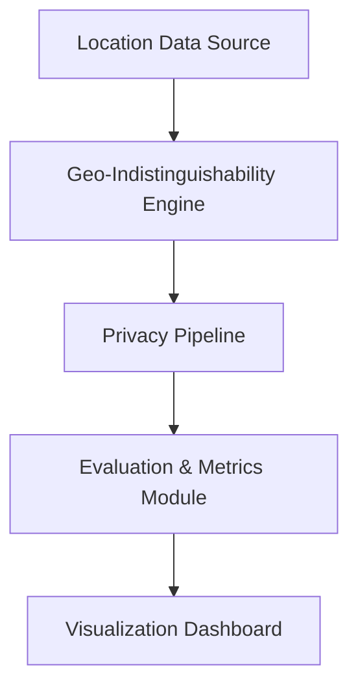

# Privacy-Preserving Location Sharing Using Geo-Indistinguishability

This repository contains a modular research prototype that demonstrates how geo-indistinguishability (a differential privacy adaptation for location data) protects GPS coordinates while maintaining location-based service (LBS) utility.

## Core Concepts
**Differential Privacy (DP)**: A formal privacy guarantee that limits how much any single record can influence outputs. Lower epsilon means stronger privacy.

**Geo-Indistinguishability**: Extends DP to locations by ensuring that nearby true locations are nearly indistinguishable after privatization. It is implemented here with Planar Laplace noise.

**Planar Laplace Mechanism**:
- Sample angle `theta` uniformly in `[0, 2pi]`
- Sample radius `r` from Gamma(k=2, scale=1/epsilon)
- Convert `(r, theta)` to a geographic displacement
- Add to the original location

Privacy radius relation: `R = 2 / epsilon`

## Architecture


## Repository Structure
```
geo-indistinguishable-location-privacy/

src/
    geo_noise.py
    gps_simulator.py
    privacy_pipeline.py
    metrics.py
    attacks.py

dashboard/
    app.py

experiments/
    benchmark.py

data/
    sample_locations.csv

notebooks/
    analysis.ipynb

docs/
    research_notes.md

requirements.txt
README.md
```

## Quick Start
1. Install dependencies:
```
pip install -r requirements.txt
```

2. Run the dashboard:
```
streamlit run dashboard/app.py
```

3. Run the benchmark experiments:
```
python experiments/benchmark.py
```

## Experimental Results (Example)
The benchmark script produces:
- `experiments/benchmark_results.csv`
- `experiments/plots/epsilon_vs_error.png`
- `experiments/plots/epsilon_vs_accuracy.png`
- `experiments/plots/epsilon_vs_traj_error.png`

These illustrate the privacy-utility tradeoff as epsilon varies.

## Documentation
See `docs/research_notes.md` for threat modeling notes and extension ideas.

## Live Bangalore Demo
The dashboard includes a live Bangalore demo that lets users enter a current location and destination.
The current location is masked using geo-indistinguishability, while the destination is shown as entered.
Place-name lookup uses OpenStreetMap Nominatim (free, rate-limited, demo usage only).
POIs can be loaded from OpenStreetMap (Overpass API) or simulated locally.

## Limitations and Ethics
- Nominatim and Overpass are rate-limited and intended for light, non-production use.
- Geo-indistinguishability protects individual locations but does not guarantee full trajectory privacy.
- Stronger privacy reduces service accuracy; deployments should document the trade-offs clearly.

## Research Extensions (Designed for)
- Trajectory-level privacy
- Adaptive geo-indistinguishability
- Clustering-based anonymization
- Privacy budget management
- ML inference attack evaluations

## Reproducibility
All simulation components accept deterministic seeds. Experiments can be repeated and extended by adjusting epsilon values, datasets, or threat models.
